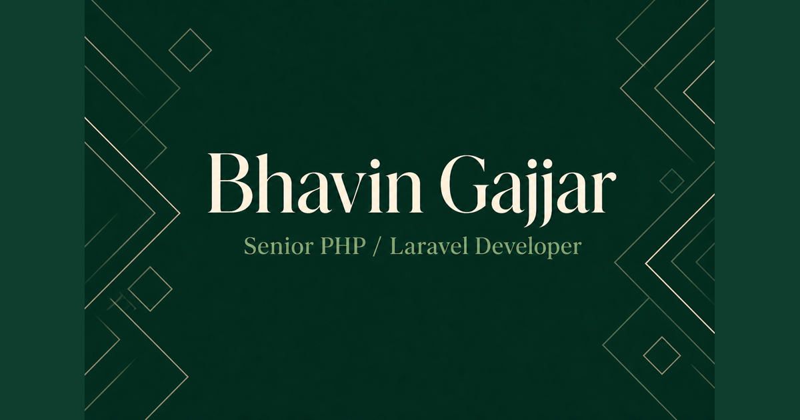

# Bhavin Gajjar — Personal Portfolio & CV Site

[](https://bhavingajjar.github.io/)
[](https://developer.mozilla.org/en-US/docs/Web/HTML)
[](https://developer.mozilla.org/en-US/docs/Web/CSS)
[](https://developer.mozilla.org/en-US/docs/Web/JavaScript)

A fast, accessible, mobile-first portfolio and CV website for **Bhavin Gajjar** — Senior PHP / Laravel Developer with 9+ years of experience in backend systems, Node.js, React.js, and cold-chain logistics platforms.

**Live site:** [https://bhavingajjar.github.io/](https://bhavingajjar.github.io/)

---

## Preview



---

## Features

| Category | Details |
|----------|---------|
| **Performance** | Zero build step — plain HTML, CSS, and vanilla JS. No frameworks, no bundlers, no runtime dependencies. |
| **Mobile-first** | Responsive layout from 320px up, with a sticky mobile contact dock and full-screen navigation overlay. |
| **Accessibility** | Skip link, semantic landmarks, ARIA labels, keyboard navigation (Escape closes menu), and `prefers-reduced-motion` support. |
| **SEO** | Canonical URLs, Open Graph & Twitter Card meta tags, JSON-LD structured data (`Person`, `ProfilePage`), `robots.txt`, and `sitemap.xml`. |
| **PWA-ready** | Web app manifest and SVG favicon for add-to-home-screen support. |
| **Animations** | Scroll-triggered reveal effects via `IntersectionObserver`, with graceful fallback when motion is reduced or unsupported. |

---

## Tech Stack

- **Markup:** Semantic HTML5
- **Styling:** Custom CSS (CSS variables, mobile-first breakpoints, `@861px` desktop layout)
- **Scripting:** Vanilla JavaScript (IIFE, no dependencies)
- **Fonts:** [Inter](https://fonts.google.com/specimen/Inter) via Google Fonts
- **Hosting:** [GitHub Pages](https://pages.github.com/)

---

## Project Structure

```
.
├── index.html              # Single-page site — all sections and structured data
├── css/
│   └── styles.css          # Mobile-first styles (~1,365 lines)
├── js/
│   └── main.js             # Nav toggle, scroll effects, reveal observer
├── assets/
│   ├── bhavin-gajjar.jpg   # Professional headshot
│   ├── og-image.png        # Open Graph / social preview image
│   └── bhavin-gajjar-senior-php-laravel-developer-resume.pdf
├── favicon.svg             # SVG favicon (BG monogram)
├── site.webmanifest        # PWA manifest
├── robots.txt              # Search engine directives
├── sitemap.xml             # Sitemap for crawlers
└── README.md
```

---

## Site Sections

1. **Hero** — Name, headline, location, CTAs (Email, LinkedIn, Download CV), and portrait
2. **About** — Current work at Celcius Logistics (Hyperlocal, WMS, TMS) and career summary
3. **Experience** — Timeline from 2014 to present across 7 roles
4. **Skills** — Languages, backend, frontend, database, DevOps, AI tools, and practices
5. **Open Source** — Featured Laravel packages on GitHub
6. **Education** — Degrees, certifications, and awards
7. **Contact** — Email, phone, social links, and CV download

---

## Local Development

No install step or build process is required. Serve the repo root with any static file server.

### Option 1 — Python (built-in)

```bash
python3 -m http.server 8080
```

Open [http://localhost:8080](http://localhost:8080).

### Option 2 — Node.js (`npx`)

```bash
npx serve .
```

### Option 3 — PHP (built-in)

```bash
php -S localhost:8080
```

> **Note:** Absolute paths (e.g. `/css/styles.css`) assume the site is served from the domain root. Use one of the commands above from the repository root so asset paths resolve correctly.

---

## Deployment

This site is deployed automatically via **GitHub Pages** from the `master` branch.

To deploy your own fork:

1. Push the repository to GitHub.
2. Go to **Settings → Pages**.
3. Set **Source** to **Deploy from a branch** and select `master` (or `main`) / root.
4. Your site will be available at `https://<username>.github.io/<repo>/` (or `https://<username>.github.io/` if the repo is named `<username>.github.io`).

After changing the domain, update canonical URLs and structured data in `index.html`, plus `robots.txt` and `sitemap.xml`.

---

## Customization

| What to change | Where |
|----------------|-------|
| Page content (bio, jobs, skills) | `index.html` |
| Colors, typography, layout | `css/styles.css` (`:root` CSS variables) |
| Navigation & scroll behavior | `js/main.js` |
| Favicon | `favicon.svg` |
| PWA name & theme | `site.webmanifest` |
| SEO / social preview image | `assets/og-image.png` + `<meta property="og:*">` tags in `index.html` |
| Resume PDF | Replace `assets/bhavin-gajjar-senior-php-laravel-developer-resume.pdf` |

### Theme colors (CSS variables)

```css
--accent: #3b82f6;        /* Primary blue */
--accent-hover: #2563eb;  /* Hover state */
--ink: #0f172a;           /* Body text */
--theme-color: #0F172A;   /* Browser chrome (also in manifest) */
```

---

## Browser Support

- Modern evergreen browsers (Chrome, Firefox, Safari, Edge)
- Mobile Safari and Chrome for Android
- Graceful degradation when `IntersectionObserver` is unavailable
- Respects `prefers-reduced-motion: reduce`

---

## Open Source Packages

Featured Laravel packages maintained by Bhavin Gajjar:

| Package | Description | Stars |
|---------|-------------|-------|
| [laravel-api-generator](https://github.com/bhavingajjar/laravel-api-generator) | REST API generator with Resources | 48+ |
| [laravel-python](https://github.com/bhavingajjar/laravel-python) | Run Python scripts from Laravel | 44+ |
| [laravel-mysql-spatial](https://github.com/bhavingajjar/laravel-mysql-spatial) | MySQL Spatial Data Types fork | — |
| [laravel-make-extender](https://github.com/limewell/laravel-make-extender) | Extended Artisan make commands | — |

Full list: [github.com/bhavingajjar](https://github.com/bhavingajjar)

---

## Contact

| | |
|---|---|
| **Email** | [gajjarbhavin22@gmail.com](mailto:gajjarbhavin22@gmail.com) |
| **Phone** | [+91 85304 53855](tel:+918530453855) |
| **LinkedIn** | [linkedin.com/in/bhavingajjar](https://www.linkedin.com/in/bhavingajjar) |
| **GitHub** | [github.com/bhavingajjar](https://github.com/bhavingajjar) |
| **Location** | Ahmedabad, Gujarat, India |

---

## License

© Bhavin Gajjar. All rights reserved.

Content, images, and the resume PDF are personal property. The site source code is open for reference and learning; please do not republish personal content without permission.
